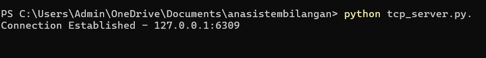

# Laporan Programming TCP vs UDP

Nama: Ana Zumrotu Nailir Rif Ah
NRP: 3124521005

## Pendahuluan
TCP dan UDP dalam Koneksi Komputer Menggunakan Python
Tujuan utama dari laporan ini adalah untuk mengidentifikasi dan menganalisis perbedaan mendasar antara dua protokol utama yang digunakan komputer untuk mengirim data: Transmission Control Protocol (TCP) dan User Datagram Protocol (UDP). Dan juga memahami perbedaan fungsional dan implementasi kedua protokol ini dianggap sebagai dasar esensial bagi mereka yang ingin memperdalam studi mereka di bidang Keamanan Komputer dan teknik-teknik Peretasan Jaringan (Network Hacking).

## 1. Implementasi TCP (Connection-Oriented)

Transmission Control Protocol (TCP) merupakan protokol Lapisan Transport yang bersifat berorientasi koneksi, yang berfungsi menyediakan layanan pengiriman data yang terurut antara aplikasi pada host sumber dan tujuan. Untuk memulai komunikasi, TCP wajib menetapkan koneksi logis melalui proses Three-Way Handshake, agar memastikan kesiapan kedua host untuk bertukar data.

### Kode program 

## 1. tcp_server.py.

import socket

if __name__ == "__main__":
    ip = "127.0.0.1"
    port = 4444

    server = socket.socket(socket.AF_INET, socket.SOCK_STREAM)
    server.bind((ip, port))
    server.listen(5)

    while True:
        client, address = server.accept()
        print(f"Connection Established - {address[0]}:{address[1]}")

        string = client.recv(1024)
        string = string.decode("utf-8")
        string = string.upper() # Mengubah string menjadi huruf kapital

        client.send(bytes(string, "utf-8"))
        client.close()

## 2. tcp_client.py.

import socket

if __name__ == "__main__":
    ip = "127.0.0.1"
    port = 4444

    server = socket.socket(socket.AF_INET, socket.SOCK_STREAM)
    server.connect((ip, port))

    string = input("Enter string: ")
    server.send(bytes(string, "utf-8"))
    
    buffer = server.recv(1024)
    buffer = buffer.decode("utf-8")
    
    print(f"Server: {buffer}")

### Alur Eksekusi TCP
1.  Server dinyalakan -> Menunggu koneksi.
2.  Klien dinyalakan -> Melakukan *handshake* -> Terhubung ("Connection Established").
3.  Klien kirim: "halo dunia(saya ganti menjadi nrp)" -> Server terima, ubah jadi "HALO DUNIA" -> Kirim balik.
4.  Klien terima "HALO DUNIA".
5.  Koneksi diputus.

### output

---

## 2. Implementasi UDP (Connectionless)

User Datagram Protocol (UDP) bekerja secara langsung dan tanpa sesi. Protokol ini tidak melakukan handshake sebelum transmisi data. Sederhananya, pengirim hanya melontarkan paket data menuju alamat yang dituju, dan tidak peduli atau tidak memastikan apakah data tersebut diterima dengan baik atau bahkan apakah penerima sudah siap.

### Kode program 

## 1. udp_server.py.

import socket

localIP     = "127.0.0.1"
localPort   = 9997
buffer      = 1024

serverSocket = socket.socket(socket.AF_INET, socket.SOCK_DGRAM)
serverSocket.bind((localIP, localPort)) # menyalakan server UDP

print("Server Up")

#listening
while(True):
    data = serverSocket.recvfrom(buffer)
    pesan = data[0].decode()
    ip_addr = data[1]

    print("Pesan dari client: \"{}\"".format(pesan))
    print("IP client: \"{}\"".format(ip_addr))

    serverSocket.sendto(b"Selamat datang di UDP server", ip_addr)

## 1. udp_client.py.

import socket

target_host = "127.0.0.1"
target_port = 9997

client = socket.socket(socket.AF_INET, socket.SOCK_DGRAM) #UDP

#kirim data
client.sendto("Test", (target_host, target_port))

#menerima data
data, addr = client.recvfrom(4096)
print("Pesan dari server: \"{}\"".format(data.decode()))

client.close()

### Alur Eksekusi UDP
1.  Server dinyalakan -> Diam (menunggu paket datang).
2.  Klien mengirim paket "Test" ke server.
3.  Server menerima paket, mencetak pesan, dan langsung membalas "Selamat datang di UDP Server".
4.  Klien menerima balasan tersebut.

---

## 3. Analisa 

Analisis perbandingan antara Transmission Control Protocol (TCP) dan User Datagram Protocol (UDP) menunjukkan perbedaan filosofi desain yang mendasar, yang menentukan skenario penggunaannya masing-masing. TCP beroperasi sebagai protokol berorientasi koneksi yang menjamin pengiriman data secara andal, terurut, dan utuh melalui implementasi mekanisme handshake tiga arah, penomoran segmen, dan mekanisme kontrol aliran serta kemacetan. Meskipun keandalannya menghasilkan overhead yang lebih tinggi dan latensi yang sedikit lebih besar, TCP adalah pilihan utama untuk aplikasi yang memerlukan integritas data penuh, seperti penjelajahan web (HTTP) dan transfer berkas. Sebaliknya, UDP adalah protokol tanpa koneksi yang secara eksplisit mengorbankan keandalan demi kecepatan dan efisiensi yang maksimal, sebab UDP mengirimkan datagram tanpa konfirmasi atau jaminan kedatangan. Oleh karena itu, UDP sangat ideal untuk aplikasi yang sensitif terhadap keterlambatan (delay) dan toleran terhadap kehilangan paket kecil, seperti streaming video real-time, VoIP, dan online gaming.

